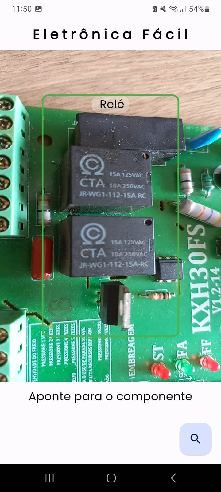
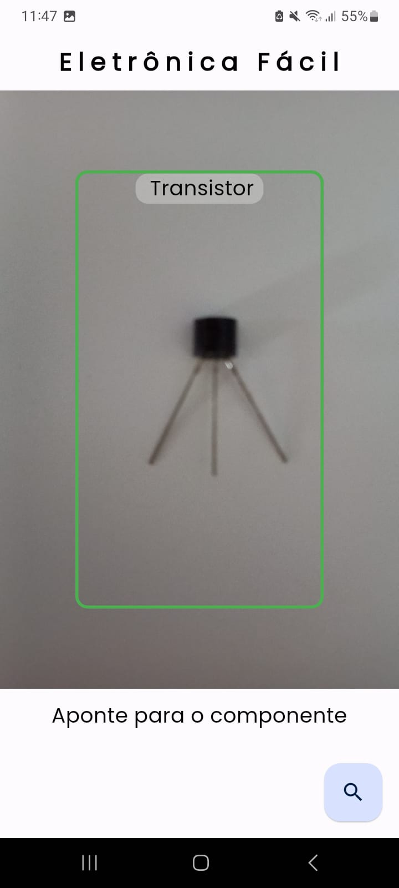
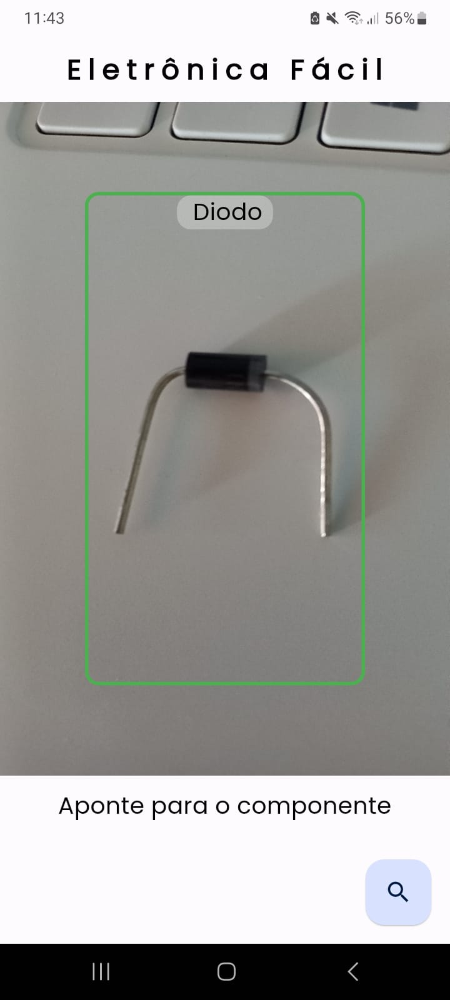
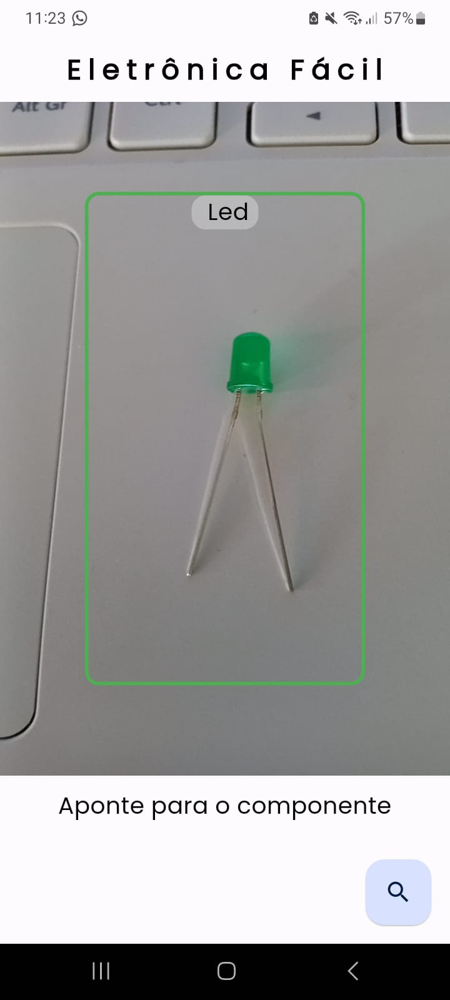

# eletronica_facil

Este projeto foi desenvolvido para testar a integração do Flutter com o TensorFlow Lite. O aplicativo é capaz de reconhecer imagens de componentes eletrônicos e futuramente será capaz de reconhecer esquemáticos de circuitos eletrônicos. Baixe o aplicativo e teste você mesmo! Ele está disponível para Android na pasta **`apk`**. Caso queira adicionar outro modelo basta clonar o repositório e colocar os arquivos `.tflite` e `.txt` na pasta `assets/modelos`, mantenha o nome dos arquivos como `model.tflite` e `labels.txt` respectivamente.

Veja algumas imagens do aplicativo:

|        |        |
|--------|--------|
|  |  |
|  |  |
